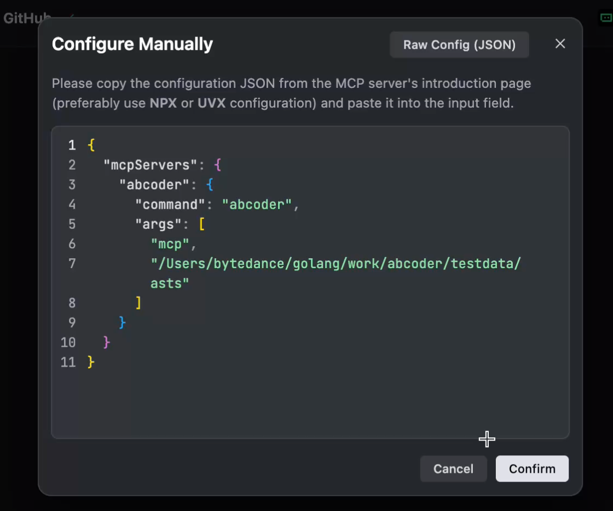

# ABCoder: AI-Based Coder(AKA: A Brand-new Coder)


# Overview
ABCoder, an AI-oriented Code-processing **Framework**, is designed to enhance and extend the coding context for Large-Language-Model (LLM), finally boosting the development of AI-assisted-programming applications. 


## Features

- Universal Abstract-Syntax-Tree (UniAST), a language-independent, AI-friendly specification of code information, providing a boundless, flexible and structural coding context for both AI and humans.
  
- General Parser, parses arbitrary-language codes to UniAST.

- General Writer transforms UniAST back to code.

- **Code-Retrieval-Augmented-Generation (Code-RAG)**, provides a set of MCP tools to help the LLM understand code repositories precisely and locally. And it can support both in-workspace and out-of-workspace third-party libraries simultaneously -- I guess you are thinking about [DeepWiki](https://deepwiki.org) and [context7](https://github.com/upstash/context7), but ABCoder is more reliable and confidential -- no need to wait for their services to be done, and no worry about your codes will be uploaded! 

Based on these features, developers can easily implement or enhance their AI-assisted programming applications, such as reviewing, optimizing, translating, etc.


## Universal Abstract-Syntax-Tree Specification

see [UniAST Specification](docs/uniast-zh.md)


# Quick Start
## Use ABCoder as a MCP server

1. Install ABCoder:

    ```bash
    go install github.com/cloudwego/abcoder@latest
    ```

2. Use ABCoder to parse a repository to UniAST (JSON)

    ```bash
    abcoder parse {language} {repo-path} -o xxx.json
    ```

    ABCoder will try to install any dependency automatically.
    In case of failure (or if you want to customize installation), refer to the [docs](./docs/lsp-installation-en.md).

    For example, to parse a Go repository:

    ```bash
    git clone https://github.com/cloudwego/localsession.git localsession
    abcoder parse go localsession -o /abcoder-asts/localsession.json
    ```


3. Integrate ABCoder's MCP tools into your AI agent.

    ```json
    {
        "mcpServers": {
            "abcoder": {
                "command": "abcoder",
                "args": [
                    "mcp",
                    "{the-AST-directory}"
                ]
            }
        }
    }
    ```


4. Enjoy it!
   
   Try to click and watch the video below:

   <div align="center">
   
   [](https://www.bilibili.com/video/BV14ggJzCEnK)
   
   </div>

    
## Tips:

- You can add more repo ASTs into the AST directory without restarting abcoder MCP server.

- Try to use [the recommened prompt](llm/prompt/analyzer.md) and combine planning/memory tools like [sequential-thinking](https://github.com/modelcontextprotocol/servers/tree/main/src/sequentialthinking) in your AI agent.


## Claude Code Integration

ABCoder provides deep integration with [Claude Code](https://claude.ai/code) through the AST-Driven Coding workflow, enabling hallucination-free code analysis and precise execution.

### Setup

1. **Install ABCoder Claude Configuration**

   Copy [`docs/.claude/`](docs/.claude/) to your home directory or project root:

   ```bash
   cp -r docs/.claude ~/
   ```

2. **Configure ABCoder MCP Server**

   Configure in Claude Code's `~/.claude.json` (the hook uses `abcoder parse go/ts . -o ~/.asts/repo.json` for the default AST folder):

   ```json
   {
       "mcpServers": {
           "abcoder": {
               "command": "abcoder",
               "args": ["mcp", "~/.asts"]
           }
       }
   }
   ```

3. **Configure Hooks**

   Claude Code will automatically read hooks from [`~/.claude/settings.json`](docs/.claude/settings.json) to enable:
   - Auto-detect language and generate AST before calling `mcp__abcoder` tools
   - Display ABCoder workflow SOP to Claude after `list_repos`
   - Remind to call `get_ast_node` recursively

### AST-Driven Coding Workflow

[`.claude/hooks`](docs/.claude/hooks) provide a 4-layer analysis chain from repository to node details:

```
list_repos → get_repo_structure → get_package_structure → get_file_structure → get_ast_node
     │              │                      │                       │                    │
     └── repo_name  └── mod/pkg list       └── file list           └── node list        └── dependencies/references
```

### Claude Code Slash Commands

[`.claude/commands`](docs/.claude/commands) provide three custom slash commands to streamline development:

| Command | Function | Description |
|---------|----------|-------------|
| [`/schd`](docs/.claude/commands/schd.md) | Design implementation | Analyze codebase using ABCoder, design technical solution |
| [`/task <name>`](docs/.claude/commands/task.md) | Create coding task | Generate standardized CODE_TASK document |
| [`/recheck <task>`](docs/.claude/commands/recheck.md) | Verify solution | Critically check CODE_TASK feasibility, useful when a CODE_TASK contains external dependencies |

### Workflow

```
User Request
    │
    ▼
/schd ────────→ Design Solution (ABCoder Analysis)
    │                     │
    ▼                     ▼
/task ────────→ CODE_TASK (with Technical Specs, including accurate `get_ast_node` call args)
    │                     │
    ▼                     ▼
/recheck ─────→ Verify Solution (ABCoder Validation. After `/task` Claude Code will tell you what the external dependencies CODE_TASK contains, use `/recheck` to analyze external ast_node and technical detail with ABCoder)
    │                     │
    ▼                     ▼
sub-agent ────→ Execute Implementation
```

### Configuration Files

| File | Purpose |
|------|---------|
| [`CLAUDE.md`](docs/.claude/CLAUDE.md) | Core AST-Driven Coder role definition |
| [`settings.json`](docs/.claude/settings.json) | Hooks and permissions configuration |
| [`hooks/`](docs/.claude/hooks/) | Automation scripts (parse/prompt/reminder) |
| [`commands/`](docs/.claude/commands/) | Slash command definitions (task/schd/recheck) |
| [`tmpls/CODE_TASK.md`](docs/.claude/tmpls/CODE_TASK.md) | Coding task template |

### Dependencies

- Claude Code CLI
- abcoder MCP server (provides `mcp__abcoder` tools)
- sequential-thinking MCP server (provides `mcp__sequential_thinking` tools, optional)

> For detailed configuration, see [docs/.claude/README.md](docs/.claude/README.md)

> Watch the demo video [here](https://github.com/cloudwego/abcoder/pull/141)


## Use ABCoder as an Agent (WIP)

You can also use ABCoder as a command-line Agent like:

```bash
export API_TYPE='{openai|ollama|ark|claude}' 
export API_KEY='{your-api-key}' 
export MODEL_NAME='{model-endpoint}' 
abcoder agent {the-AST-directory}
```
For example:

```bash
$ API_TYPE='ark' API_KEY='xxx' MODEL_NAME='zzz' abcoder agent ./testdata/asts

Hello! I'm ABCoder, your coding assistant. What can I do for you today?

$ What does the repo 'localsession' do?

The `localsession` repository appears to be a Go module (`github.com/cloudwego/localsession`) that provides functionality related to managing local sessions. Here's a breakdown of its structure and purpose:
...
If you'd like to explore specific functionalities or code details, let me know, and I can dive deeper into the relevant files or nodes. For example:
- What does `session.go` or `manager.go` implement?
- How is the backup functionality used?

$ exit
```

- NOTICE: This feature is Work-In-Progress. It only supports code analysis at present.

# Supported Languages

ABCoder currently supports the following languages:

| Language | Parser | Writer      |
| -------- | ------ | ----------- |
| Go       | ✅      | ✅           |
| Rust     | ✅      | Coming Soon |
| C        | ✅      | Coming Soon |
| Python   | ✅      | Coming Soon |
| JS/TS    | ✅      | Coming Soon |
| Java     | ✅      | Coming Soon |


# Getting Involved

We encourage developers to contribute and make this tool more powerful. If you are interested in contributing to ABCoder
project, kindly check out our guide:
- [Parser Extension](docs/parser-zh.md)

> Note: This is a dynamic README and is subject to changes as the project evolves.


# Contact Us
- How to become a member: [COMMUNITY MEMBERSHIP](https://github.com/cloudwego/community/blob/main/COMMUNITY_MEMBERSHIP.md)
- Issues: [Issues](https://github.com/cloudwego/abcoder/issues)
- Lark: Scan the QR code below with [Register Feishu](https://www.feishu.cn/en/) to join our CloudWeGo/abcoder user group.

&ensp;&ensp;&ensp; 

# Contributors
Thank you for your contribution to ABCoder!

[](https://github.com/cloudwego/abcoder/graphs/contributors)

# License
This project is licensed under the [Apache-2.0 License](LICENSE-APACHE).
