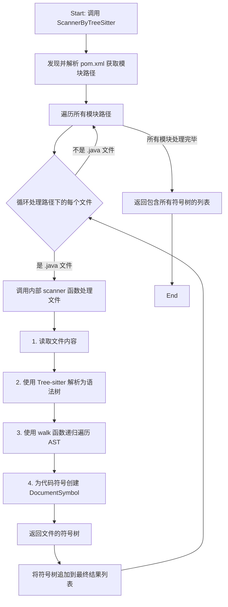

# `ScannerByTreeSitter` 方法详解

## 1. 方法概述

`ScannerByTreeSitter` 是 `Collector` 结构体的核心方法，其主要职责是利用 `tree-sitter` 对指定的代码仓库（目前主要针对 Java 语言）进行深度扫描和解析，提取出代码中的关键符号信息（如类、接口、方法、字段等），并最终构建一个结构化的符号树（`DocumentSymbol` 树）。

该方法是实现代码理解、代码分析、代码导航等高级功能的基础。

## 2. 核心概念

在深入理解该方法之前，需要了解以下几个核心概念：

*   **Tree-sitter**: 一个高效、增量的解析器生成工具。它能够将源代码文件解析成具体的语法树（CST），并支持对树进行高效的查询。本方法利用它来识别代码中的各种语法结构。
*   **DocumentSymbol**: 一个用于表示代码符号（如变量、函数、类）的结构体。它包含了符号的名称、类型、范围（在文件中的起止位置）以及子符号列表，从而能够以树状结构完整地表示一个源文件的结构。
*   **Collector**: 负责收集代码符号信息的实体。`ScannerByTreeSitter` 作为其核心方法，驱动整个符号收集过程。

## 3. 工作流程详解

为了更直观地理解整个过程，以下是该方法工作流程的 Mermaid 流程图：

`ScannerByTreeSitter` 的工作流程可以分解为以下几个主要步骤：

`ScannerByTreeSitter` 的工作流程可以分解为以下几个主要步骤：

### 步骤 1: 模块路径发现 (Module Path Discovery)

-   **目标**: 识别项目中所有需要被解析的 Java 模块。
-   **实现**:
    1.  方法首先会寻找项目根目录下的 `pom.xml` 文件。
    2.  通过解析 `pom.xml`，提取 `<modules>` 标签下定义的所有子模块路径。
    3.  如果 `pom.xml` 不存在或没有定义模块，则默认将项目根目录作为唯一的模块路径。

### 步骤 2: 配置与初始化 (Configuration & Initialization)

-   **目标**: 为代码解析和符号提取做准备。
-   **实现**:
    1.  **LSP (Language Server Protocol) 配置**: 初始化并配置一个用于与 Java 语言服务器交互的客户端。这一步是为了后续可能需要的更高级的语义分析（尽管在当前代码中未直接体现）。
    2.  **定义文件扫描器 (`scanner` function)**: 在方法内部定义了一个名为 `scanner` 的闭包函数。这个函数封装了对单个文件进行解析和符号提取的完整逻辑，是整个流程的核心执行单元。

### 步骤 3: 文件遍历与扫描 (File Traversal & Scanning)

-   **目标**: 遍历所有模块路径下的 `.java` 文件，并使用 `scanner` 函数进行处理。
-   **实现**:
    1.  方法会遍历在**步骤 1**中发现的所有模块路径。
    2.  对于每个模块路径，它会递归地遍历所有文件和子目录。
    3.  当遇到以 `.java` 结尾的文件时，调用 `scanner` 函数。
    4.  `scanner` 函数执行以下操作：
        *   读取文件内容。
        *   通过 LSP `DidOpen` 通知，告知语言服务器文件已被打开。
        *   调用 `javaparser.Parse` 方法，该方法内部使用 `tree-sitter-java` 解析器将文件内容转换成一棵语法树 (`*sitter.Tree`)。
        *   调用 `walk` 方法，从语法树的根节点开始递归遍历，提取符号信息。

### 步骤 4: 递归遍历语法树 (`walk` function)

-   **目标**: 深度遍历 `tree-sitter` 生成的语法树，识别并提取所有有意义的符号。
-   **实现**:
    1.  `walk` 函数是实际的符号提取器，它接收一个语法树节点 (`*sitter.Node`) 作为输入。
    2.  函数通过一个 `switch` 语句判断当前节点的类型（如 `class_declaration`, `method_declaration`, `field_declaration` 等）。
    3.  根据不同的节点类型，它会：
        *   提取符号的名称（`name`）、类型（`kind`）和范围（`span`）。
        *   创建一个对应的 `DocumentSymbol` 实例。
        *   对于容器类型的符号（如类、接口），它会递归调用 `walk` 函数来处理其所有子节点，并将返回的子符号列表附加到当前符号的 `Children` 字段中。
    4.  这个递归过程确保了整个文件的代码结构被完整地映射到一个 `DocumentSymbol` 树中。

### 步骤 5: 返回结果

-   **目标**: 汇总所有文件的符号信息并返回。
-   **实现**:
    1.  `ScannerByTreeSitter` 方法维护一个 `roots` 列表，用于存储每个被解析文件的根 `DocumentSymbol`。
    2.  每当 `scanner` 函数成功处理一个文件后，其返回的符号树会被追加到 `roots` 列表中。
    3.  在遍历完所有文件后，方法最终返回这个 `roots` 列表，其中包含了整个代码仓库的结构化符号信息。

## 4. 总结

`ScannerByTreeSitter` 方法通过**文件遍历 → Tree-sitter 解析 → 语法树递归遍历**的核心流程，将一个复杂的 Java 代码仓库的目录和文件结构，高效地转换成了一个由 `DocumentSymbol` 对象组成的、能够精确反映代码层级关系（类、方法、字段等）的符号树集合。这个结构化的数据是后续进行代码分析、智能重构、跨文件引用分析等高级功能的重要基石。