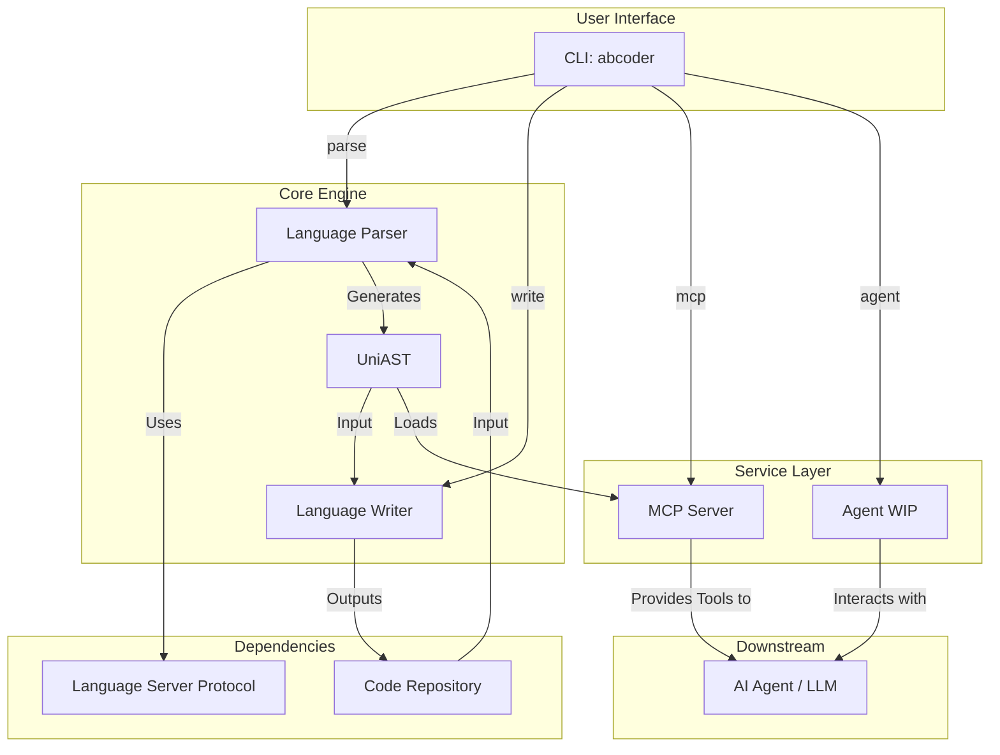
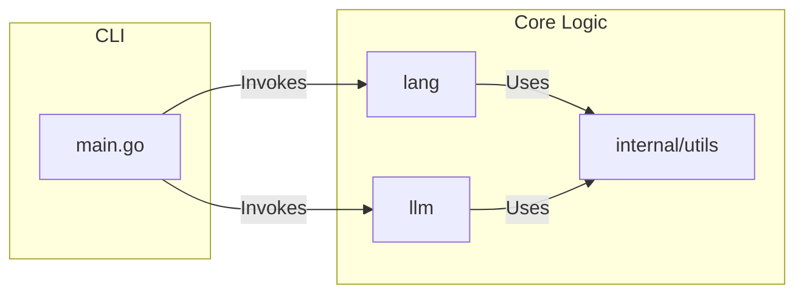
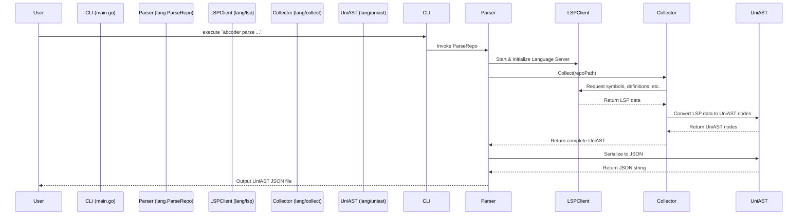
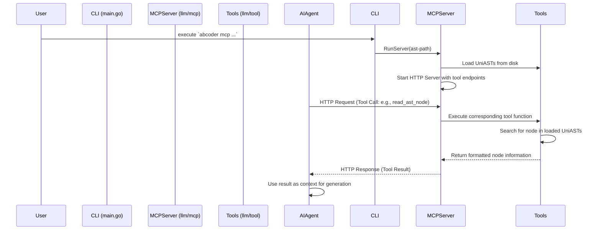

# ABCoder 系统架构文档

## 1. 引言 (Introduction)

本文档旨在为研发团队提供 ABCoder 系统的全面技术解析，帮助新成员、系统维护者及架构评审者快速理解其设计理念、核心功能与技术实现。

**面向对象**:
- 新入职研发人员
- 系统维护与迭代开发人员
- 架构评审与技术决策者

**系统概览**: ABCoder 是一个面向 AI 的代码处理框架，旨在通过提供语言无关的统一抽象语法树（UniAST）和代码检索增强生成（Code-RAG）能力，扩展大语言模型（LLM）的编码上下文，从而赋能 AI 辅助编程应用。

## 2. 业务背景与核心概念 (Business Context & Concepts)

**业务场景与价值**:
ABCoder 的核心价值在于弥合大语言模型（LLM）在理解复杂代码仓库时的上下文鸿沟。传统的 LLM 服务在处理代码时，通常受限于输入长度，难以理解整个项目的结构、依赖关系和编码规范。ABCoder 通过将代码仓库预解析为结构化的 UniAST，并提供高效的检索工具，使 AI Agent 能够“在本地”精确理解代码，从而在代码审查、功能实现、bug 修复、代码翻译等场景下发挥更大作用。

**核心业务对象与术语**:
- **UniAST (Universal Abstract-Syntax-Tree)**: 一种语言无关、AI 友好的代码信息规范。它将不同编程语言的源代码转换为统一的、结构化的抽象语法树，包含了代码实体（如函数、类、变量）的定义、依赖关系、元数据等信息。
- **Parser (解析器)**: 负责将特定编程语言的源代码解析成 UniAST。ABCoder 利用语言服务器协议（LSP）来实现对多种语言的精确解析。
- **Writer (写入器)**: 负责将 UniAST 还原为特定编程语言的源代码。
- **Code-RAG (Code-Retrieval-Augmented-Generation)**: 代码检索增强生成。ABCoder 提供了一套 MCP（Model Context Protocol）工具，允许 LLM Agent 精确、局部地查询代码仓库的 UniAST，支持工作区内和工作区外的第三方库。
- **MCP (Model Context Protocol)**: 一种模型上下文协议，用于 AI Agent 与外部工具（如 ABCoder）之间的交互。ABCoder 作为 MCP 服务器，向 Agent 提供查询代码知识库的能力。
- **LSP (Language Server Protocol)**: 语言服务器协议。ABCoder 借此协议与各语言的 Language Server（如 `rust-analyzer`, `pylsp`）通信，以获取代码的符号、定义、引用等精确信息。

**与上下游系统的集成关系**:
- **上游**:
    - **代码仓库 (Code Repository)**: ABCoder 的处理对象，可以是任意语言的 Git 仓库。
    - **语言服务器 (Language Server)**: ABCoder 的 `Parser` 依赖各语言的 LSP Server 来实现代码解析。
- **下游**:
    - **AI Agent / 大语言模型 (LLM)**: ABCoder 作为 MCP 服务器，为 AI Agent 提供代码上下文和检索能力。Agent 通过调用 ABCoder 提供的工具来理解和操作代码。

## 3. 系统总体架构 (System Architecture)

ABCoder 的系统架构围绕着“解析、存储、服务”三个核心环节构建。它首先将多语言代码仓库通过统一的 `Parser` 转换为 `UniAST` 格式，然后以文件形式存储。最终，通过 `MCP Server` 或 `Agent` 模式，将代码的结构化知识提供给大语言模型（LLM）。

## 4. 模块划分与职责 (Module Overview)

ABCoder 的代码结构清晰，主要模块各司其职，共同构成了整个系统的核心功能。

**关键模块说明**:

- **`main.go`**: 
    - **功能说明**: 命令行程序的入口。负责解析用户输入的子命令（`parse`, `write`, `mcp`, `agent`）和参数，并调用相应的功能模块。
    - **核心函数**: `main()`

- **`lang`**: 
    - **功能说明**: 语言处理核心模块，负责代码的解析（`Parser`）与生成（`Writer`）。
    - **核心子模块**:
        - `uniast`: 定义了统一抽象语法树（`UniAST`）的 Go 结构。
        - `lsp`: 实现了与语言服务器协议（LSP）的客户端交互，为解析器提供底层的符号、定义、引用查找能力。
        - `collect`: 实现了从 LSP 符号信息到 UniAST 的转换逻辑。
        - `golang`, `python`, `rust`, `cxx`: 针对不同语言的 `LanguageSpec` 实现，适配各语言 LSP 的特性。
        - `patch`: 负责将修改后的 UniAST 应用回原代码文件。
    - **调用关系**: 被 `main.go` 调用以执行 `parse` 和 `write` 命令。内部依赖 `internal/utils`。

- **`llm`**: 
    - **功能说明**: 负责与大语言模型（LLM）的集成和交互。
    - **核心子模块**:
        - `mcp`: 实现了 MCP（Model Context Protocol）服务器。当以 `mcp` 模式运行时，此模块负责加载 UniAST 文件，并向 AI Agent 提供查询工具（`tool`）。
        - `agent`: 实现了一个简单的命令行 Agent（WIP），集成了 LLM 客户端和 `tool`，可以直接与用户进行代码问答。
        - `tool`: 定义了可供 LLM 调用的工具集，如 `read_ast_node`, `write_ast_node` 等，这些工具是 Code-RAG 的核心。
        - `prompt`: 存放了用于指导 LLM Agent 分析代码的提示模板。
    - **调用关系**: 被 `main.go` 调用以启动 `mcp` 服务或 `agent`。内部依赖 `internal/utils`。

- **`internal/utils`**: 
    - **功能说明**: 内部工具库，提供项目共享的辅助函数，如文件操作、序列化/反序列化、字符串处理等。
    - **调用关系**: 被 `lang` 和 `llm` 模块广泛使用。

## 5. 核心流程详解 (Core Workflows)

### 5.1 流程一：解析代码仓库 (Parsing a Code Repository)

这是 ABCoder 最基础的功能，将一个代码仓库转换为一个 UniAST JSON 文件。

**步骤拆解**:
1. 用户在命令行中执行 `abcoder parse {language} {repo-path}`。
2. `main.go` 解析命令，确定语言和仓库路径，调用 `lang.ParseRepo` 函数。
3. `lang.ParseRepo` 根据语言类型，启动对应的语言服务器（LSP）。
4. `lsp.NewClient` 创建一个与 LSP Server 通信的客户端。
5. `collect.Collect` 模块开始遍历仓库中的源文件。
6. 对于每个文件，通过 LSP 的 `textDocument/documentSymbol` 获取文件中的所有符号（函数、类等）。
7. 对于每个符号，通过 `textDocument/definition` 和 `textDocument/semanticTokens/range` 等方法，解析其定义、依赖关系和元数据。
8. `collect` 模块将收集到的 LSP 信息转换为 `uniast.Node` 结构。
9. 所有文件处理完毕后，`uniast.Writer` 将完整的 UniAST 序列化为 JSON 格式，并输出到指定文件或标准输出。

**时序图**:

### 5.2 流程二：通过 MCP 服务进行代码分析 (Code Analysis via MCP Server)

此流程展示了 AI Agent 如何利用 ABCoder 提供的 Code-RAG 能力来理解代码。

**步骤拆解**:
1. 用户启动 ABCoder 的 MCP 服务器：`abcoder mcp {ast-directory-path}`。
2. `main.go` 调用 `llm/mcp.RunServer`。
3. `RunServer` 加载指定目录下所有的 UniAST JSON 文件，构建起一个代码知识库。
4. `RunServer` 启动一个 HTTP 服务器，并注册 `llm/tool` 中定义的工具（如 `read_ast_node`）作为 MCP 端点。
5. AI Agent（下游系统）向 MCP 服务器发起一个工具调用请求，例如查询某个函数的定义。
6. MCP 服务器的 `handler` 接收请求，并执行对应的工具函数，例如 `tool.ReadASTNode`。
7. 工具函数在内存中的 UniAST 知识库里进行检索，找到匹配的节点。
8. 找到节点后，将其信息格式化为对 LLM 友好的文本。
9. MCP 服务器将结果返回给 AI Agent。
10. AI Agent 获得代码的精确信息，并将其作为上下文来生成对用户问题的回答。

**时序图**:

## 6. 数据模型与存储设计 (Data Design)

ABCoder 的核心数据模型是 **UniAST (Universal Abstract-Syntax-Tree)**，它是一种精心设计的、语言无关的 JSON 结构，用于持久化存储代码仓库的结构化信息。

**存储方式**:
- 每个被解析的代码仓库最终会生成一个独立的 JSON 文件（例如 `my-repo.json`）。
- 这个 JSON 文件完整地描述了仓库的模块、包、文件、代码实体（函数、类型、变量）及其相互关系。
- 当作为 `MCP Server` 运行时，ABCoder 会加载这些 JSON 文件到内存中，以提供快速的查询服务。

**核心数据结构 (UniAST)**:
UniAST 的顶层结构主要包括 `Repository`，其下又包含 `Modules` 和 `Graph`。

- **`Repository`**: 代表整个代码仓库。
    - `Identity`: 仓库的唯一标识，通常是其在文件系统中的绝对路径。
    - `Modules`: 一个字典，包含了仓库内所有模块（包括主模块和依赖的第三方模块）的详细信息。
    - `Graph`: 一个依赖拓扑图，存储了代码中所有实体节点（`Node`）之间的关系。

- **`Module`**: 代表一个独立的编译单元（例如 Go Module, Rust Crate）。
    - `Name`, `Language`, `Version`: 模块的基本信息。
    - `Packages`: 包含的包（`Package`）的字典。
    - `Dependencies`: 模块的第三方依赖。
    - `Files`: 模块下的所有文件信息，包括代码和非代码文件。

- **`Package`**: 代表一个命名空间（例如 Go Package, Python Module）。
    - `Functions`, `Types`, `Vars`: 分别存储了包内定义的函数、类型和全局变量的 AST 节点。

- **`Node` (Function, Type, Var)**: 这是 UniAST 中最核心的元素，代表一个具体的代码实体。
    - **`Identity` (`ModPath`, `PkgPath`, `Name`)**: 每个节点的全球唯一标识，确保了查询的精确性。
    - `File`, `Line`, `StartOffset`, `EndOffset`: 精确的源码定位信息。
    - `Content`: 该实体完整的源代码文本。
    - `Signature`: 函数/方法的签名。
    - `Dependencies` & `References`: 详细记录了该节点依赖了哪些其他节点，以及被哪些其他节点所依赖，这是构建 `Graph` 的基础。
    - `TypeKind`, `IsMethod`, `IsConst` 等: 描述实体特性的元数据字段。

**数据一致性策略**:
- ABCoder 的数据是一次性生成的。当源代码发生变更时，需要重新执行 `abcoder parse` 命令来更新整个 UniAST JSON 文件，以保证数据与代码的同步。系统本身不处理增量更新或实时同步。

## 7. 异步机制与调度系统 (Async & Scheduler)

根据当前代码库的分析，ABCoder 本身的核心逻辑（`parse`, `write`）是同步阻塞执行的。它不包含复杂的消息队列、后台任务调度或常驻的异步工作线程。

- **`mcp` 服务**: `mcp` 模式下会启动一个长时运行的 HTTP 服务器，该服务器本身是并发的，可以处理多个来自 AI Agent 的请求。这依赖于 Go 语言标准库 `net/http` 的并发能力。
- **`agent` 模式**: `agent` 模式下的交互是请求-响应式的，不涉及异步处理。

因此，系统没有独立的异步机制或调度系统章节。

## 8. 配置与环境依赖 (Configuration & Environment)

**配置文件**:
ABCoder 主要通过命令行参数进行配置，没有独立的配置文件（如 `.yaml` 或 `.env`）。关键的配置项都在执行命令时指定，例如：
- `abcoder parse {language} {repo-path} -o {output.json}`
- `abcoder mcp {ast-directory-path}`
- `abcoder agent {ast-directory-path}`

**环境变量**:
当使用 `agent` 模式时，需要通过环境变量配置 LLM 的凭证：
- `API_TYPE`: 指定 LLM 服务类型 (e.g., `openai`, `ollama`, `ark`, `claude`)
- `API_KEY`: 对应的 API 密钥
- `MODEL_NAME`: 使用的具体模型名称

**环境依赖**:
- **Go**: 运行 ABCoder 本身需要 Go 语言环境 (`go install ...`)。
- **Language Servers**: 为了解析不同语言的仓库，必须在环境中预先安装对应的语言服务器。这在 `docs/lsp-installation-zh.md` 中有详细说明：
    - **Rust**: `rust-analyzer`
    - **Python**: `pylsp` (通过 git submodule 安装)
    - **C/C++**: `clangd`
- **Git**: 用于克隆代码仓库。

## 10. 测试与监控体系 (Testing & Observability)

**测试策略**:
项目包含了一定数量的单元测试和集成测试，主要集中在 `_test.go` 文件中。
- **单元测试**: 针对 `internal/utils`, `lang/uniast`, `lang/lsp` 等核心模块的独立功能进行测试。
- **集成测试**: 在 `lang/{language}` 目录下，通常有针对该语言解析、写入全流程的测试。例如，`lang/rust/rust_test.go`。
- **测试数据**: `testdata` 目录存放了用于测试的各种语言的示例代码仓库。

**监控与日志**:
- **日志**: 系统在 `lang/log` 和 `llm/log` 中定义了日志记录器。在运行过程中，会将关键步骤、错误信息输出到标准错误流，方便用户调试。
- **监控**: 当前版本的 ABCoder 没有集成专门的监控系统（如 Prometheus, Sentry）。其作为一个命令行工具和后台服务，主要依赖日志进行状态观测。

## 11. FAQ 与开发建议

**新人常见问题**:
- **Q: 解析新的语言为什么失败？**
  - **A**: 首先检查是否已按照 `docs/lsp-installation-zh.md` 的指引正确安装了该语言的 Language Server，并确保其可执行文件在系统的 `PATH` 环境变量中。
- **Q: `mcp` 服务启动了，但是 AI Agent 无法获取信息？**
  - **A**: 确认 `mcp` 命令指向的目录中包含了正确的 `.json` UniAST 文件。检查 AI Agent 的配置，确保其正确地指向了 ABCoder 的 MCP 服务地址和端口。
- **Q: UniAST 中的 `ModPath` 和 `PkgPath` 有什么区别？**
  - **A**: `ModPath` 通常指一个完整的项目或库（如 `github.com/cloudwego/hertz`），而 `PkgPath` 是项目内的一个具体包或命名空间（如 `github.com/cloudwego/hertz/pkg/app`）。详细定义请参考 `docs/uniast-zh.md`。

**开发建议**:
- **扩展新语言**: 扩展对新语言的支持是项目的主要贡献方向。开发者需要实现 `lang/lsp.LanguageSpec` 接口，并参考 `lang/rust` 或 `lang/python` 目录下的实现。
- **代码生成**: 在 `lang/patch` 和 `lang/{language}/writer` 中，可以改进代码生成（`write`）的逻辑，使其更好地支持代码修改和重构。
- **遵守规范**: 提交代码前，请确保通过了所有的单元测试，并遵循项目的编码规范。