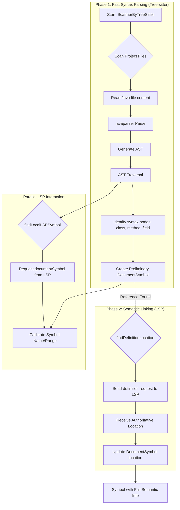

# 文档：如何使用 Tree-sitter 和 LSP 实现符号解析

## 1. 引言

本文档旨在深入解析 `abcoder` 项目中实现的符号解析（Symbol Resolution）机制。该机制采用了一种创新的混合模式，结合了 **Tree-sitter** 的快速语法分析能力和 **语言服务器协议（LSP）** 的深度语义理解能力。

通过阅读本文，开发人员可以理解以下内容：

-   符号信息收集的整体流程和核心调用链路。
-   Tree-sitter 如何用于快速构建代码的抽象语法树（AST）并识别基本代码结构。
-   LSP 如何在 Tree-sitter 的基础上提供精确的语义信息，如“跳转到定义”（Go to Definition）。
-   这种混合模式为何能兼顾解析速度与语义准确性。

## 2. 核心组件与调用链路

符号解析的核心逻辑位于 `lang/collect/collect.go` 文件中，主要由 `Collector` 结构体及其方法驱动。

### 2.1. 调用链路概览

整个符号收集过程的调用链路如下：

1.  **入口点**: 外部调用（例如 `lang/parse.go` 中的 `collectSymbol` 函数）是流程的起点。
2.  **初始化 Collector**: 通过 `collect.NewCollector(repoPath, cli)` 创建一个 `Collector` 实例。此实例包含了 LSP 客户端 `cli` 和一个针对特定语言的规约 `spec`。
3.  **开始收集**: 调用 `Collector.Collect(ctx)` 方法，这是符号收集的主逻辑。
4.  **策略分支**: 在 `Collect` 方法内部，系统会根据语言做出策略选择：
    *   **对于 Java 语言**: 调用 `ScannerByTreeSitter` 方法，进入 Tree-sitter + LSP 的混合解析模式。
    *   **对于其他语言 (如 Rust)**: 调用 `ScannerFile` 方法，进入纯 LSP 的解析模式。

### 2.2. 核心组件

-   **`Collector`**: 一个中心协调器，负责管理符号收集的整个生命周期，包括配置、文件扫描、符号提取和关系构建。
-   **`LSPClient`**: LSP 客户端的封装，用于与语言服务器（如 `jdt.ls`、`rust-analyzer`）通信，发送请求（如 `textDocument/definition`）并接收响应。
-   **`LanguageSpec`**: 定义了特定语言的行为和规则，例如如何解析导入语句、如何判断符号类型等。
-   **Tree-sitter Parser**: （主要在 `lang/java/parser` 中）用于将源代码字符串高效地解析成具体的语法树（CST/AST）。

## 3. Tree-sitter 语法解析 (AST Parsing)

当处理 Java 项目时，`ScannerByTreeSitter` 方法被触发，它首先利用 Tree-sitter 进行快速的语法结构分析。

### 3.1. 流程详解

1.  **项目扫描**:
    *   首先，它会尝试解析项目根目录下的 `pom.xml` 文件，以获取所有 Maven 模块的路径。
    *   然后，它会遍历这些模块路径下的所有 `.java` 文件。

2.  **文件解析**:
    *   对于每个 Java 文件，它会读取文件内容。
    *   调用 `javaparser.Parse(ctx, content)`，该函数内部使用 Tree-sitter 将文件内容解析成一棵完整的语法树（`sitter.Tree`）。
    *   通知 LSP 服务器文件已打开 (`c.cli.DidOpen(ctx, uri)`)，以便 LSP 服务器建立对该文件的认知。

3.  **AST 遍历与初步符号化**:
    *   获得语法树后，调用 `c.walk(tree.RootNode(), ...)` 方法，从根节点开始深度优先遍历 AST。
    *   `walk` 方法通过一个 `switch node.Type()` 语句来识别不同类型的语法节点，例如：
        *   `package_declaration` (包声明)
        *   `import_declaration` (导入语句)
        *   `class_declaration` (类定义)
        *   `method_declaration` (方法定义)
        *   `field_declaration` (字段定义)
    *   当匹配到类、方法等定义节点时，它会从节点中提取名称、范围等信息，并创建一个初步的 `DocumentSymbol` 对象。这个对象此时主要包含**语法信息**，其定义位置就是当前文件中的位置。

```go
// Simplified version of the walk method in collect.go
func (c *Collector) walk(node *sitter.Node, ...) {
    switch node.Type() {
    case "class_declaration":
        // 1. Extract class name from the node
        nameNode := javaparser.FindChildIdentifier(node)
        name := nameNode.Content(content)

        // 2. Create a preliminary DocumentSymbol based on syntax info
        sym := &DocumentSymbol{
            Name: name,
            Kind: SKClass,
            Location: Location{URI: uri, Range: ...}, // Location within the current file
            Node: node, // Store the tree-sitter node
            Role: DEFINITION,
        }
        c.syms[sym.Location] = sym

        // 3. Recursively walk into the class body
        bodyNode := node.ChildByFieldName("body")
        if bodyNode != nil {
            for i := 0; i < int(bodyNode.ChildCount()); i++ {
                c.walk(bodyNode.Child(i), ...)
            }
        }
        return

    case "method_declaration":
        // ... similar logic for methods ...
    }
}
```

## 4. LSP 语义增强 (Semantic Enhancement)

仅靠 Tree-sitter 只能知道“这里有一个类定义”，但无法知道一个变量引用的具体类型定义在何处（尤其是在其他文件中）。这时，LSP 的作用就体现出来了。

在 `walk` 遍历和后续处理中，系统会利用 LSP 来“增强”由 Tree-sitter 创建的符号。

### 4.1. 流程详解

1.  **获取精确的定义位置**:
    *   当 Tree-sitter 解析到一个引用（例如一个类继承 `extends MyBaseClass` 或一个字段声明 `private MyType myVar;`）时，它会创建一个代表该引用的临时符号。
    *   随后，系统调用 `c.findDefinitionLocation(ref)` 方法。该方法内部会向 LSP 服务器发送一个 `textDocument/definition` 请求。
    *   LSP 服务器（已经索引了项目）会返回该符号的**真正定义位置**，可能在另一个文件，甚至在依赖的库中。
    *   `Collector` 用 LSP 返回的权威位置更新符号的 `Location` 字段。

    ```go
    // Get the precise definition location from LSP
    func (c *Collector) findDefinitionLocation(ref *DocumentSymbol) Location {
        // Send a "go to definition" request to the LSP server
        defs, err := c.cli.Definition(context.Background(), ref.Location.URI, ref.Location.Range.Start)
        if err != nil || len(defs) == 0 {
            // If LSP can't find it (e.g., external library), return the reference location
            return ref.Location
        }
        // Return the authoritative location from LSP
        return defs[0]
    }
    ```

2.  **校准符号信息**:
    *   在 `walk` 方法中，当创建一个 `DocumentSymbol`（如类或方法）时，会调用 `c.findLocalLSPSymbol(uri)`。
    *   此函数会向 LSP 请求当前文件的所有符号（`textDocument/documentSymbol`），并将其缓存。
    *   然后，它会用 LSP 返回的符号列表来校准 Tree-sitter 找到的符号。例如，LSP 提供的 `method` 符号名称通常包含完整的签名（如 `myMethod(String)`），这比 Tree-sitter 单纯提取的 `myMethod` 更精确。

## 5. 流程总结与图示

系统通过两阶段的过程实现高效而准确的符号解析：

1.  **阶段一 (语法解析)**: 使用 Tree-sitter 快速扫描所有源文件，构建 AST，并识别出所有的定义和引用的基本语法结构。
2.  **阶段二 (语义链接)**: 遍历阶段一的成果，对每一个引用，利用 LSP 的 `definition` 请求查询其权威定义位置，从而建立起跨文件的符号依赖关系图。

### Mermaid 架构图



## 6. 结论

`abcoder` 采用的 Tree-sitter + LSP 混合符号解析模型是一个非常出色的工程实践。它结合了：

-   **Tree-sitter 的优点**:
    -   **极高的性能**: 无需预热或完整的项目索引，可以非常快速地解析单个文件。
    -   **容错性强**: 即使代码有语法错误，也能生成部分可用的 AST。
    -   **纯粹的语法分析**: 专注于代码结构，不依赖复杂的构建环境。

-   **LSP 的优点**:
    -   **强大的语义理解**: 能够理解整个项目的上下文，包括依赖、继承关系和类型推断。
    -   **准确性高**: 提供的是经过语言服务器深度分析后的权威信息。

通过让 Tree-sitter 完成粗粒度的结构化解析，再由 LSP 进行精确的语义“链接”，该系统在保证分析速度的同时，实现了高度准确的符号依赖关系构建，为上层代码理解和智能操作提供了坚实的基础。