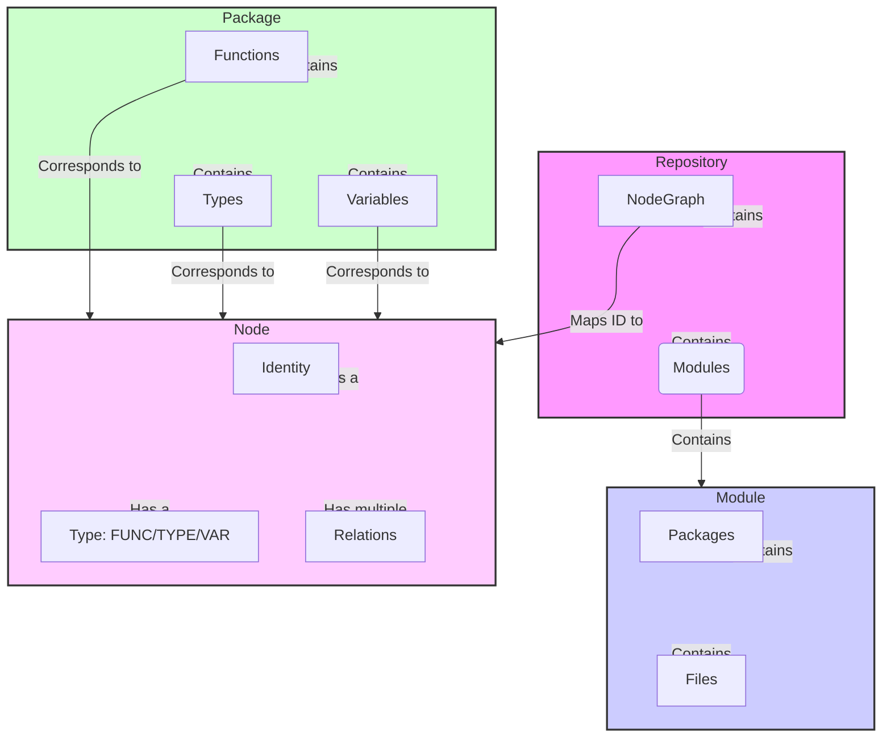
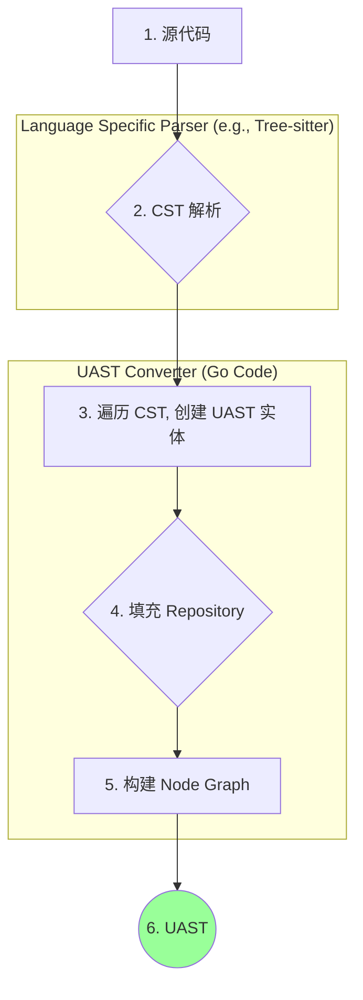
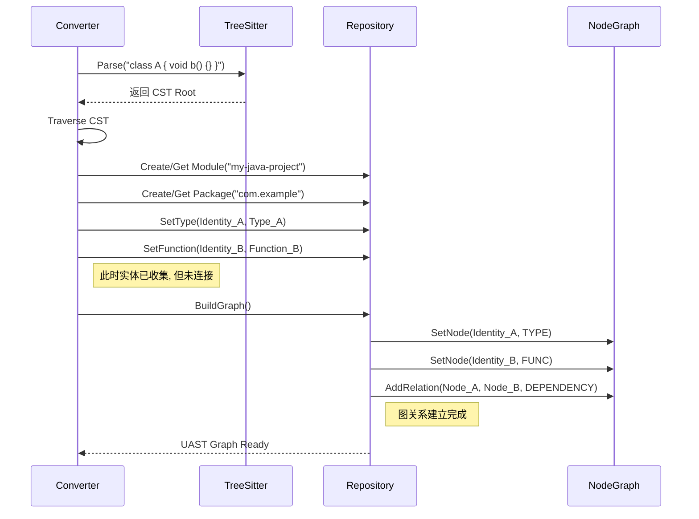

# UAST 结构与转换流程详解

## 1. 引言

本文档旨在详细解析项目中的 **UAST (Universal Abstract Syntax Tree, 统一抽象语法树)** 的核心数据结构、设计理念以及从特定语言的 CST (Concrete Syntax Tree, 具体语法树) 到 UAST 的转换流程。

**面向读者**:
*   **新加入的研发人员**: 快速理解项目核心的代码表示层。
*   **语言扩展开发者**: 在为项目支持新语言时，提供标准的 UAST 构建指南。
*   **架构师与代码分析工具开发者**: 深入了解 UAST 的设计，以便于上层应用的开发与集成。

**系统概览**: UAST 是本项目中用于表示多语言代码的统一中间表示。它将不同编程语言的语法结构抽象为一组通用的、包含丰富语义信息的图结构，是实现跨语言代码分析、转换和生成等功能的核心基础。

## 2. 核心概念与数据结构

UAST 的设计围绕着几个核心概念展开，它们共同构成了一个强大的代码表示模型。

### 2.1. 顶层结构

*   `Repository`: 代码库的最高层级抽象，包含一个或多个 `Module`。
*   `Module`: 代表一个独立的、特定语言的代码单元，例如一个 Go Module、一个 Java Maven 项目或一个 Python 包。
*   `Package`: 语言内部的命名空间，如 Go 的 `package` 或 Java 的 `package`。
*   `File`: 代表一个物理源代码文件。

### 2.2. 核心实体：`Node`

`Node` 是 UAST 图模型中最基本的单元。每个 `Node` 代表代码中的一个具名实体。

*   **`NodeType`**: 节点类型，主要分为三种：
    *   `FUNC`: 代表函数或方法。
    *   `TYPE`: 代表类、结构体、接口、枚举等类型定义。
    *   `VAR`: 代表全局变量或常量。

*   **`Identity`**: 全局唯一标识符，是链接不同 `Node` 的关键。它由三部分组成：
    *   `ModPath`: 模块路径 (e.g., `github.com/your/project@v1.2.0`)
    *   `PkgPath`: 包路径 (e.g., `github.com/your/project/internal/utils`)
    *   `Name`: 实体名称 (e.g., `MyFunction`, `MyStruct.MyMethod`)
    *   **完整形式**: `ModPath?PkgPath#Name`

### 2.3. 实体详情

每个 `Node` 都关联一个更详细的实体描述结构，存储了该实体的具体信息。

*   **`Function`**: 存储函数的签名、参数、返回值、接收者（如果是方法）以及它调用的其他函数/方法列表。
*   **`Type`**: 存储类型的种类（`struct`, `interface` 等）、字段、内嵌/继承的类型、实现的方法和接口。
*   **`Var`**: 存储变量的类型、是否为常量/指针等信息。

### 2.4. 关系：`Relation`

`Relation` 用于描述两个 `Node` 之间的关系，是构建 UAST 图谱的边。

*   **`RelationKind`**: 关系类型，主要包括：
    *   `DEPENDENCY`: 表示一个节点依赖另一个节点（例如函数调用、类型使用）。
    *   `IMPLEMENT`: 表示一个类型节点实现了一个接口节点。
    *   `INHERIT`: 表示一个类型节点继承了另一个类型节点。
    *   `GROUP`: 表示多个变量/常量在同一个声明块中定义。

### 2.5. UAST 核心结构图

下图展示了 UAST 核心数据结构之间的关系。

## 3. 从 CST 到 UAST 的转换流程

将特定语言的源代码转换为统一的 UAST，主要分为以下几个步骤。此流程的核心思想是 **“先收集实体，再建立关系”**。

### 3.1. 流程概览

### 3.2. 步骤详解

1.  **CST 解析**:
    *   使用 `tree-sitter` 或其他特定语言的解析器，将输入的源代码字符串解析为一棵具体语法树 (CST)。CST 完整地保留了代码的所有语法细节，包括标点和空格。

2.  **遍历 CST, 创建 UAST 实体**:
    *   编写一个针对该语言的 `Converter`。这个转换器会深度优先遍历 CST。
    *   当遇到代表函数、类、接口、变量声明等关键语法节点时，提取其核心信息（名称、位置、内容等）。
    *   为每个识别出的实体创建一个对应的 UAST 结构（`Function`, `Type`, `Var`），并为其生成一个全局唯一的 `Identity`。
    *   在此阶段，也会初步解析实体内部的依赖关系，例如一个函数内部调用了哪些其他函数，这些信息会被临时存储在 `Function.FunctionCalls` 等字段中。

3.  **填充 Repository**:
    *   将上一步创建的所有 `Function`, `Type`, `Var` 实体，按照其 `Identity` 中定义的模块和包路径，存入一个 `Repository` 对象中。此时，我们得到了一个包含所有代码实体信息但关系尚未连接的“半成品”。

4.  **构建 Node Graph (`Repository.BuildGraph`)**:
    *   这是将离散的实体连接成图的关键一步。调用 `Repository.BuildGraph()` 方法。
    *   该方法会遍历 `Repository` 中的每一个 `Function`, `Type`, `Var`。
    *   为每一个实体在 `Repository.Graph` 中创建一个 `Node`。
    *   然后，它会检查每个实体的依赖字段（如 `Function.FunctionCalls`, `Type.Implements` 等）。
    *   根据这些依赖信息，在对应的 `Node` 之间创建 `Relation`，从而将整个图连接起来。例如，如果 `FunctionA` 调用了 `FunctionB`，那么在 `NodeA` 和 `NodeB` 之间就会建立一条 `DEPENDENCY` 关系的边。

### 3.3. 转换时序图示例

以下是一个简化的时序图，展示了从 Java 代码到 UAST 的转换过程。

## 4. 如何使用 UAST

一旦 UAST 构建完成，你就可以利用它进行各种强大的代码分析：

*   **依赖分析**: 从任意一个 `Node` 出发，沿着 `Dependencies` 关系，可以找到它的所有依赖项。反之，沿着 `References` 可以找到所有引用它的地方。
*   **影响范围分析**: 当一个函数或类型发生变更时，可以通过 `References` 关系，快速定位到所有可能受影响的代码。
*   **代码导航**: 实现类似 IDE 的“跳转到定义”、“查找所有引用”等功能。
*   **重构**: 自动化地进行代码重构，例如重命名一个方法，并更新所有调用点。

## 5. FAQ 与开发建议

*   **为什么不直接使用 CST?**
    *   CST 过于具体且语言相关，直接使用它进行跨语言分析非常困难。UAST 提供了一个统一的、更高层次的抽象视图。
*   **如何添加对新语言的支持?**
    *   1.  找到或构建一个该语言的 `tree-sitter` 解析器。
    *   2.  实现一个新的 `Converter`，负责遍历该语言的 CST，并创建 UAST 实体。
    *   3.  确保 `Identity` 的生成规则与其他语言保持一致。
*   **LSP 的作用是什么?**
    *   虽然 `tree-sitter` 能提供语法结构，但很多语义信息（如一个变量的具体类型、一个函数调用到底解析到哪个定义）需要更复杂的类型推导。LSP 已经完成了这些工作，可以作为信息来源，极大地丰富 UAST 中 `Relation` 的准确性和语义信息。在转换流程中，可以集成 LSP 查询来辅助确定依赖关系。